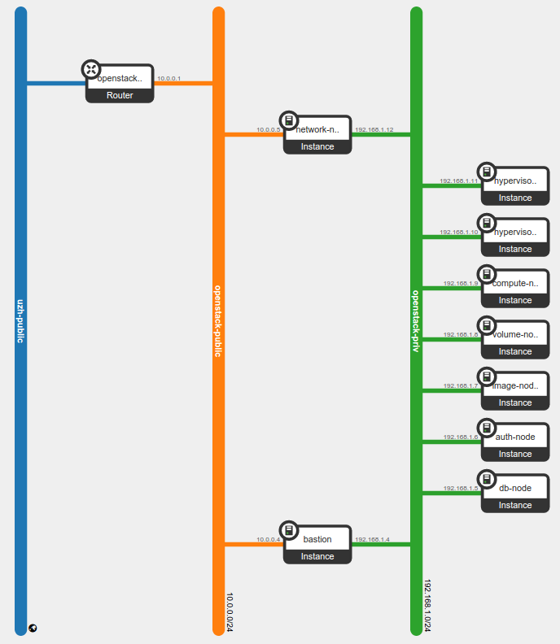

---------------------------------
Preparation of the infrastructure
---------------------------------

During this tutorial, each one of you will have access to an OpenStack
private cloud and will create one instance per service:

* ``db-node``:  runs *MySQL* and *RabbitMQ*

* ``auth-node``: runs *keystone*, the identity and authentication
  service

* ``image-node``: runs **glance**, the image storage, composed of the
  *glance-api* and glance-registry* services

* ``compute-node``: runs most of the **nova** service: *nova-api*,
  *nova-scheduler*, *nova-conductor* and *nova-console*. It also runs
  the web frontend of OpenStack (*horizon*)

* ``volume-node``: runs **cinder**, the volume manager, composed of
  the *cinder-api*, *cinder-scheduler* and *cinder-volume* services

* ``network-node``: runs **neutron**, the NaaS manager. 

* ``hypervisor-1``: runs *nova-compute*

* ``hypervisor-2``: runs *nova-compute*

Each one of these nodes will run a specific OpenStack service. In
general, you are not required to run each service on a different node,
and in fact many OpenStack installations have a `controller node`
running most of the services. However, it's good practice to separate
the services, either using different hosts (virtual or physical) or
using Linux Containers.

Deploying OpenStack using Linux Containers is out of the scope of this
workshop, but we still want to show you how things *should* be done,
and this is why we will prepare one VM per service.

Moreover, since the services usually assume that all the other
services are running on the same host, some errors in the
configuration file are not easy to spot until you deploy the services
on separate hosts.

Network configuration
---------------------

The big picture
+++++++++++++++

Services that usually need access to the public network in an
OpenStack deployment are those that implements the network APIs and
provide network connectivity to the VMs:

+--------------+---------------------------------+
| node         | service requiring public access |
+==============+=================================+
| compute-node | nova-api, horizon               |
+--------------+---------------------------------+
| volume-node  | cinder-api                      |
+--------------+---------------------------------+
| image-node   | glance-api                      |
+--------------+---------------------------------+
| auth-node    | keystone                        |
+--------------+---------------------------------+
| network-node | neutron-api + NAT               |
+--------------+---------------------------------+

Also, all the OpenStack nodes (including the hypervisors) are usually
connected to an internal network used for the internal communication
among all the services.

In a scalable and highly available deployment you would usually put
all the API services behind a load balancer. In this case, only the
network node(s) will need direct access to at least one public
network.

However, installation of a load balancer is out of the scope of this
tutorial, and since we cannot provide the amount of public IPs that
would be needed to test a fully functional OpenStack cloud to all of
the attendees, we will use a bastion host to redirect (using DNAT) the
traffic to the correct service.

.. note: there are other practical reasons: unless you give neutron an
.. interface directly on the public network, floating IPs will not
.. work. Also, you should pre-allocate the floating IPs so that
.. neutron could use them. And, again, you need to disable the
.. port-security-enabled feature...

To mimic a real-world deployment, we will use two networks, one to be
intended as the management network (`openstack-priv`), the other would
be the public network (`openstack-public`).

+------+-----------------------+-------------------------------------------------+
| iface| network               | IP range                                        |
+======+=======================+=================================================+
| eth0 | openstack-priv        | 192.168.1.3 - 192.168.1.254                     |
+------+-----------------------+-------------------------------------------------+
| eth1 | openstack-public      | 10.0.0.3 - 10.0.0.254                           |
+------+-----------------------+-------------------------------------------------+

*(you can use different IP networks, but this documentation assumes
these IPv4 ranges for these networks)*

Only the bastion host and the network node will have an interface on
the `openstack-public` network. All the other hosts will have at least
one interface in `openstack-priv` network.

On a production environment it's likely that you have even more
internal networks, possibly associated to different physical
interfaces or at least different VLANs.

A complex production setup would probably have:

* a management network, to monitor and manage the physical nodes with
  your configuration and management system of your choice
* a service network, dedicated for the openstack internal traffic
  (RabbitMQ, MySQL, internal API)
* an *integration network*, used to transport the VM-VM traffic, from
  hypervisor to hypervisor and from the hypervisor to the network
  node.
* possibly, a storage network
* possibly, a completely independent network for HA (to avoid split
  brain, and depending on your HA setup)

For simplicity, during this workshop the `openstack-priv` network will
be used for all these purposes.

.. The *OpenStack private network* is the internal network of the
.. OpenStack virtual machines. The virtual machines need to communicate
.. with the network node, (unless a "multinode setup is used") and among
.. them, therefore this network is configured only on the network node
.. (that also need to have an IP address in it) and the compute nodes,
.. which only need to have an interface on this network attached to a
.. bridge the virtual machines will be attached to. On a production
.. environment you would probably use a separated L2 network for this,
.. either by using VLANs or using a second physical interface. This is
.. why in this tutorial we have added a second interface to the compute
.. nodes, that will be used for VM-VM communication and to communicate
.. with the network node.

The following diagram shows both the network layout of the physical
machines and of the virtual machines running in it:

FIXME: change diagram

How to connect to the VMs
+++++++++++++++++++++++++

There is still a problem though: we only have one VM we can access
from the lab: the bastion host. We will use DNAT to redirect the
service ports to the internal hosts, but how can we ssh on the VMs to
manage them?

There are multiple options:

* use `sshuttle <https://github.com/apenwarr/sshuttle>`_ (strongly
  suggested)
* ssh to the bastion host and then ssh to the openstack VMs using the
  IPs in the `openstack-public` network
* use DNAT (port forwarding) to redirect, for instance, tcp/2021 on
  bastion host to port tcp/22 on auth-node; tcp/2022 to tcp/22 on
  compute node etc etc.
* use ssh port forwarding to redirect, for each node, a local port on
  your laptop to the remote tcp/22 port of the node

We strongly suggest you to use sshuttle, and to modify your local
``/etc/hosts`` file to easily access the OpenStack VMs using the
names.

**FIXME: run sshuttle with the proper options**
Since we are using DHCP for both openstack-{priv,public} network,
you should configure the ``/etc/hosts`` file on all of your virtual 
machines in order to be able to connect to them using only the hostname.

After you started all of your virtual machines, you could do something like::

     FIXME: to be done over sshuttle?
     user@ubuntu:~$ IPS=$(nova list --fields name,networks | grep openstack-priv|sed 's/.*openstack-priv=\(192.168.[0-9]\+\.[0-9]\+\).*/\1/g')
     user@ubuntu:~$ for ip in $IPS; do echo "$ip $(ssh  root@${ip} hostname).example.org" >> /tmp/hosts; done
     user@ubuntu:~$ for ip in $IPS; do priv=$(ssh root@$ip 'ifconfig eth1 | grep "inet addr" | sed "s/.*addr:\(10.0.0.[0-9]\+\).*/\1/g"'); host=$(ssh root@$ip hostname); echo "$priv $host" >> /tmp/hosts; done

Then, add this file to ``/etc/hosts`` on all the machines::

    user@ubuntu:~$ for ip in $IPS; do cat /tmp/hosts | ssh root@$ip 'cat >> /etc/hosts'; done

Configuring Neutron networks
++++++++++++++++++++++++++++

First of all create a network which will simualte the "public" network
in real world scenario::

   user@ubuntu:~$ neutron net-create openstack-public

   +-----------------------+--------------------------------------+
   | Field                 | Value                                |
   +-----------------------+--------------------------------------+
   | admin_state_up        | True                                 |
   | id                    | c5217907-ead8-4862-afda-bea30a79cb5a |
   | mtu                   | 0                                    |
   | name                  | openstack-public                     |
   | port_security_enabled | True                                 |
   | router:external       | False                                |
   | shared                | False                                |
   | status                | ACTIVE                               |
   | subnets               |                                      |
   | tenant_id             | f4c492a4c3744a85bc654ecbe592d478     |
   +-----------------------+--------------------------------------+

Then create a subnet inside the network we have just created::

   user@ubuntu:~$ neutron subnet-create openstack-public 10.0.0.0/24 \
      --name openstack-public-subnet \
      --allocation-pool start=10.0.0.3,end=10.0.0.254 \
      --enable-dhcp --gateway 10.0.0.1 
   
   Created a new subnet:
   +-------------------+--------------------------------------------+
   | Field             | Value                                      |
   +-------------------+--------------------------------------------+
   | allocation_pools  | {"start": "10.0.0.2", "end": "10.0.0.254"} |
   | cidr              | 10.0.0.0/24                                |
   | dns_nameservers   |                                            |
   | enable_dhcp       | True                                       |
   | gateway_ip        | 10.0.0.1                                   |
   | host_routes       |                                            |
   | id                | b832df6d-6d89-42a3-8471-c5bc971a8802       |
   | ip_version        | 4                                          |
   | ipv6_address_mode |                                            |
   | ipv6_ra_mode      |                                            |
   | name              | openstack-public-subnet                    |
   | network_id        | c5217907-ead8-4862-afda-bea30a79cb5a       |
   | subnetpool_id     |                                            |
   | tenant_id         | f4c492a4c3744a85bc654ecbe592d478           |
   +-------------------+--------------------------------------------+

Create a router to be used of connecting the 'uzh-public' (so, Internet) to the 'openstack-public' network::
  
    user@ubuntu:~$ neutron router-create openstack-public-to-uzh-public

    Created a new router:
    +-----------------------+--------------------------------------+
    | Field                 | Value                                |
    +-----------------------+--------------------------------------+
    | admin_state_up        | True                                 |
    | external_gateway_info |                                      |
    | id                    | 3024c6b6-daf5-4ce1-8456-1a29e80194c3 |
    | name                  | openstack-public-to-uzh-public       |
    | routes                |                                      |
    | status                | ACTIVE                               |
    | tenant_id             | f4c492a4c3744a85bc654ecbe592d478     |
    +-----------------------+--------------------------------------+

Add an interface (it is like adding a physical patch) from the
openstack-public-subnet to the router we have just created::

    user@ubuntu:~$ neutron router-interface-add \
        openstack-public-to-uzh-public \
        openstack-public-subnet
    Added interface 38f22ccf-88cd-4a4f-8719-82caad291b60 to router openstack-public-to-uzh-public.

Set the router to act as a gateway for the uzh-public network::

    user@ubuntu:~$ neutron router-gateway-set \
      openstack-public-to-uzh-public \
      uzh-public
    Set gateway for router openstack-public-to-uzh-public

Now we go on with creating the network which will simulate the private
network of the OpenStack installation::

    user@ubuntu:~$ neutron net-create openstack-priv
    Created a new network:
    +-----------------------+--------------------------------------+
    | Field                 | Value                                |
    +-----------------------+--------------------------------------+
    | admin_state_up        | True                                 |
    | id                    | d2af2831-6a4e-4672-8a9b-022958ebc870 |
    | mtu                   | 0                                    |
    | port_security_enabled | True                                 |
    | name                  | openstack-priv                       |
    | router:external       | False                                |
    | shared                | False                                |
    | status                | ACTIVE                               |
    | subnets               |                                      |
    | tenant_id             | f4c492a4c3744a85bc654ecbe592d478     |
    +-----------------------+--------------------------------------+

Create a subnet in the network we have just created::

    user@ubuntu:~$ neutron subnet-create openstack-priv \
      192.168.1.0/24 \
      --name openstack-priv-subnet \
      --dns-nameserver "130.60.128.3" \
      --dns-nameserver "130.60.64.51" \
      --allocation-pool start=192.168.1.3,end=192.168.1.254 \
      --enable-dhcp \
      --no-gateway
    Created a new subnet:
    +-------------------+--------------------------------------------------+
    | Field             | Value                                            |
    +-------------------+--------------------------------------------------+
    | allocation_pools  | {"start": "192.168.1.3", "end": "192.168.1.254"} |
    | cidr              | 192.168.1.0/24                                   |
    | dns_nameservers   | 130.60.128.3                                     |
    |                   | 130.60.64.51                                     |
    | enable_dhcp       | True                                             |
    | gateway_ip        |                                                  |
    | host_routes       |                                                  |
    | id                | 8ca24812-d535-4fa3-a094-90be24deaf91             |
    | ip_version        | 4                                                |
    | ipv6_address_mode |                                                  |
    | ipv6_ra_mode      |                                                  |
    | name              | openstack-priv-subnet                            |
    | network_id        | d2af2831-6a4e-4672-8a9b-022958ebc870             |
    | subnetpool_id     |                                                  |
    | tenant_id         | f4c492a4c3744a85bc654ecbe592d478                 |
    +-------------------+--------------------------------------------------+

Some notes on the creation of this network:

* we need to add the dns nameservers to ensure the internal dnsmasq of
  OpenStack will forward the dns requests.
* we are creating an *isoltated network* (``--no-gateway``), i.e. we
  will not connect this network to a router. The bastion will work as
  a router for it.
* since we disabled the gateway, we will need to *inject* the default
  route to the VMs in a different way, but we haven't started the
  bastion host yet, so we don't know which route to inject :)

.. FIXME: why do we need to remove the gw? I forgot.

Starting the virtual machines
-----------------------------

.. Open the browser at http://cscs2015.s3it.uzh.ch/horizon and login
.. using one of the very secret login/password we gave you. Each one of
.. you will have a project on its own, called `projectNN` and an user
.. belonging to that project, called `userNN`. The teacher will use
.. `user01` and `project01` while the tutor will user `user20` and
.. `project20`.

.. Since we are going to use the bastion host for connecting to the VMs
.. where the OpenStack services will be installed we have to be ensure
.. ourself access is to those VMs is possible. There are two different
.. ways to achieve that:

.. - use sshuttle and connect to the VMs directly from the lab
.. - enable the `ForwardAgent` in your ssh configuration, ssh to the
..   bastion and then to the other VMs
.. - create a new ssh key on the bastion host and add import it as a new
..   keypair on the outer cloud, so that you can connect from the bastion.

In our setup we are going to use a "bastion VM" as a gateway for the
rest of the OpenStack services. Since by default Ubuntu is bringing up
only the first network interface [#sadnote]_ and the routing between the
"openstack-public" and the "uzh-public" is provided by the
"openstack-public-to-uzh-public" router, when starting the VM we have
to ensure that "openstack-public" is provided via NIC1 as shown on the
picture.

Of course, the order is preserved also when you start from command
line.

Assume this is the output of ``nova net-list``::

    +--------------------------------------+------------------+------+
    | ID                                   | Label            | CIDR |
    +--------------------------------------+------------------+------+
    | 4cb131d5-5ece-4122-9014-ac069cd8d4a3 | uzh-public       | None |
    | 9a4ce8c1-950c-4432-86ef-a8ba4a9d0e28 | openstack-public | None |
    | dad2ca78-380e-48aa-8454-1218feb47947 | openstack-priv   | None |
    +--------------------------------------+------------------+------+

we will start our bastion host with::

    user@ubuntu:~$ nova boot --key-name antonio --image ubuntu-trusty --nic net-id=9a4ce8c1-950c-4432-86ef-a8ba4a9d0e28 --nic net-id=dad2ca78-380e-48aa-8454-1218feb47947 --flavor m1.small bastion
    +--------------------------------------+------------------------------------------------------+
    | Property                             | Value                                                |
    +--------------------------------------+------------------------------------------------------+
    | OS-DCF:diskConfig                    | MANUAL                                               |
    | OS-EXT-AZ:availability_zone          | nova                                                 |
    | OS-EXT-STS:power_state               | 0                                                    |
    | OS-EXT-STS:task_state                | scheduling                                           |
    | OS-EXT-STS:vm_state                  | building                                             |
    | OS-SRV-USG:launched_at               | -                                                    |
    | OS-SRV-USG:terminated_at             | -                                                    |
    | accessIPv4                           |                                                      |
    | accessIPv6                           |                                                      |
    | adminPass                            | aW4xmTkbfULE                                         |
    | config_drive                         |                                                      |
    | created                              | 2015-11-28T11:31:07Z                                 |
    | flavor                               | m1.small (2)                                         |
    | hostId                               |                                                      |
    | id                                   | 8c03b65a-1c2f-46f6-a96b-db37ecd17955                 |
    | image                                | ubuntu-trusty (588e1d38-c9ba-4481-a484-67bbc83935b3) |
    | key_name                             | antonio                                              |
    | metadata                             | {}                                                   |
    | name                                 | bastion                                              |
    | os-extended-volumes:volumes_attached | []                                                   |
    | progress                             | 0                                                    |
    | security_groups                      | default                                              |
    | status                               | BUILD                                                |
    | tenant_id                            | 648477bbdd0747bfa07497194f20aac3                     |
    | updated                              | 2015-11-28T11:31:07Z                                 |
    | user_id                              | 71aad312e9bf420b8cfe83715b60e691                     |
    +--------------------------------------+------------------------------------------------------+

Ensure you have a free floating IP::

    antonio@kenny:~$ nova floating-ip-create uzh-public
    +--------------------------------------+---------------+-----------+----------+------------+
    | Id                                   | IP            | Server Id | Fixed IP | Pool       |
    +--------------------------------------+---------------+-----------+----------+------------+
    | caa28fb1-3f7f-406c-94ad-408089f1167c | 130.60.24.120 | -         | -        | uzh-public |
    +--------------------------------------+---------------+-----------+----------+------------+

and associate it to the bastion::

    antonio@kenny:~$ nova floating-ip-associate bastion 130.60.24.120

Once the VM is up and running take note of the IP assigned on the
openstack-priv network and change the openstack-priv network to use
that IP as a gateway::

   user@ubuntu:~$ neutron subnet-update openstack-priv-subnet \
     --host-route destination=0.0.0.0/0,nexthop=<IP_OF_THE_BASTION_ON_THE_PRIV_NETWORK>

Of course, you have to configure the bastion network by hand. Edit
``/etc/network/interfaces.d/eth1.cfg``::

    root@bastion:~# cat > /etc/network/interfaces.d/eth1.cfg <<EOF
    auto eth1
    iface eth1 inet static
      address 192.168.1.4
      netmask 255.255.255.0
    EOF
    root@bastion:~# ifup eth1

We also need to configure forwarding and masquerading for the private
network. Again, this is out of the scope of the tutorial, but just as
a reference these are the commands that you shuold issue::
   
   root@bastion:~# echo 1 > /proc/sys/net/ipv4/ip_forward
   root@bastion:~# iptables -t nat -A POSTROUTING -o eth0 -j MASQUERADE
   root@bastion:~# iptables -A FORWARD -i eth1 -o eth0 -m state --state RELATED,ESTABLISHED -j ACCEPT
   root@bastion:~# iptables -A FORWARD -i eth0 -o eth1 -j ACCEPT

You can persist those changes using by:

- use iptables-save to save the iptables rules,
- set net.ipv4.ip_forward=1 inside /etc/sysctl.conf. 

.. Next step is disabling the security constrains Neutron is a applying
.. in order to avoid arp spoofing. In our case this optsion will prevent
.. MASQUERADING to work properly. In order to do this you have to find
.. the port used from the bastion host on the openstack-priv network::

However, this is not working unless we disable the port security on
neutron::

    user@ubuntu:~$ nova interface-list bastion
    +------------+--------------------------------------+--------------------------------------+--------------+-------------------+
    | Port State | Port ID                              | Net ID                               | IP addresses | MAC Addr          |
    +------------+--------------------------------------+--------------------------------------+--------------+-------------------+
    | ACTIVE     | 38d19638-dfdf-4ec8-b147-94ee13fe8477 | 9a4ce8c1-950c-4432-86ef-a8ba4a9d0e28 | 10.0.0.4     | fa:16:3e:5f:77:76 |
    | ACTIVE     | d1c936fd-ac6b-4d1c-a154-d07d4dce48b8 | dad2ca78-380e-48aa-8454-1218feb47947 | 192.168.1.4  | fa:16:3e:bc:c2:36 |
    +------------+--------------------------------------+--------------------------------------+--------------+-------------------+

Disable the security groups and port security on that port::

   user@ubuntu:~$ neutron port-update --no-security-groups \
     --port-security-enabled=False \
     d1c936fd-ac6b-4d1c-a154-d07d4dce48b8

..    
    There is a problem with this option since Neutron is blocking the forwared connections. 
    Chain neutron-openvswi-s25c99e62-6 (1 references)
    pkts bytes target     prot opt in     out     source               destination         
    2159  176K RETURN     all  --  any    any     192.168.1.10         anywhere             MAC FA:16:3E:20:FC:5C /* Allow traffic from defined IP/MAC pairs. */
    2919  245K DROP       all  --  any    any     anywhere             anywhere             /* Drop traffic without an IP/MAC allow rule. */
    We fixed this by adding xtension_drivers = port_security in /etc/neutron/plugins/ml2/ml2_conf.ini. This will create the relative entry in the database so next time network is created the "port_security_enabled" filed will be available and operations over it will be grated 

Assuming everything worked smoothly in the steps above you can start
with booting all the VMs we will need for setting up the OpenStack
installation::

    user@ubuntu:~$ nova net-list
    +--------------------------------------+------------------+------+
    | ID                                   | Label            | CIDR |
    +--------------------------------------+------------------+------+
    | 4cb131d5-5ece-4122-9014-ac069cd8d4a3 | uzh-public       | None |
    | 9a4ce8c1-950c-4432-86ef-a8ba4a9d0e28 | openstack-public | None |
    | dad2ca78-380e-48aa-8454-1218feb47947 | openstack-priv   | None |
    +--------------------------------------+------------------+------+

Now we can start all the other VMs::

    user@ubuntu:~$ for node in {db,auth,image,volume,compute}-node hypervisor-{1,2};
      do nova boot --key-name antonio \
      --image ubuntu-trusty \
      --flavor m1.small \
      --nic net-id=$(neutron net-show -c id -f value openstack-priv) \
      $node
      done

Since the network node needs an interface on the openstack-public
interface we have to start it seprately using the following command::

    user@ubuntu:~$ nova boot --key-name antonio \
      --image ubuntu-trusty \
      --flavor m1.small \
      --nic net-id=$(neutron net-show -c id -f value openstack-priv) \
      --nic net-id=$(neutron net-show -c id -f value openstack-public) \
      network-node

.. FIXME: doesn't it mess up with the routing of the network node? To check

Access the Virtual Machines
---------------------------

If you setup your access method correctly you should be able to login
on all VMs from the bastion host.

You can see the IP address of the VM via web interface or using `nova` command::

    user@ubuntu:~$ nova list 
    +--------------------------------------+--------------+--------+------------+-------------+----------------------------------------------------------------------+
    | ID                                   | Name         | Status | Task State | Power State | Networks                                                             |
    +--------------------------------------+--------------+--------+------------+-------------+----------------------------------------------------------------------+
    | 728623a2-259b-46f7-a53e-9fcda839c75d | api-node     | ACTIVE | -          | Running     | openstack-priv=192.168.1.12                                          |
    | 2b5659df-95c9-45af-b0b4-7190c71fc3b6 | auth-node    | ACTIVE | -          | Running     | openstack-priv=192.168.1.9                                           |
    | 2b583336-1982-4055-bd50-b01568c4b033 | bastion      | ACTIVE | -          | Running     | openstack-priv=192.168.1.4; openstack-public=10.0.0.9, 130.60.24.111 |
    | 4cc83df7-a27b-40c3-8de6-e1a0ec384c15 | db-node      | ACTIVE | -          | Running     | openstack-priv=192.168.1.8                                           |
    | 67cf3888-20c9-45ec-a341-ab46a725a2eb | hypervisor-1 | ACTIVE | -          | Running     | openstack-priv=192.168.1.13                                          |
    | 16111abc-728e-4e83-a77d-360b645db3ca | hypervisor-2 | ACTIVE | -          | Running     | openstack-priv=192.168.1.14                                          |
    | 58510251-2c76-4795-9f02-1a6e93fddecd | image-node   | ACTIVE | -          | Running     | openstack-priv=192.168.1.10                                          |
    | 079d5549-2799-49ca-9bb2-0fa11c419edd | network-node | ACTIVE | -          | Running     | openstack-priv=192.168.1.15; openstack-public=10.0.0.10              |
    | 9504ef02-3897-4e7f-813b-bef14a7d68f5 | volume-node  | ACTIVE | -          | Running     | openstack-priv=192.168.1.11                                          |
    +--------------------------------------+--------------+--------+------------+-------------+----------------------------------------------------------------------+

Let's use sshuttle to connect directly to the nodes, just run the
following::

    user@ubuntu:~$ sshuttle -r ubuntu@130.60.24.120 192.168.1.0/24 10.0.0.0/24

You might want to update the ``/etc/hosts`` of your laptop to add the
private IPs to the VMs. Something like this will do the trick::

    user@ubuntu:~$ openstack server list -c Networks -c Name \
    -f value |\
    sed 's/^\([^ ]*\) openstack-priv=\([^,;]*\).*/\2    \1/' > /tmp/hosts

If everything worked as expected, you should be able to connect to the
single nodes. Since I'm lazy and I want to connect directly as root, I
will also run::

    user@ubuntu:~$ for node in \
      {db,auth,image,volume,compute,network}-node hypervisor-{1,2}
      do ssh ubuntu@$node 'sudo sed -i "s/.*ssh-/ssh-/g" /root/.ssh/authorized_keys'
      done

Let's also update the ``/etc/hosts`` also on those nodes::

    user@ubuntu:~$ for node in \
      {db,auth,image,volume,compute,network}-node hypervisor-{1,2};
      do cat /tmp/hosts | ssh root@$node 'cat >> /etc/hosts';  done

Now you should be able to connect to any node with ssh from your laptop.

Install openstack repository and ntp
------------------------------------

Before starting with the installation of the services, it's a good
idea to

* install the openstack repository for Liberty on all the nodes
* upgrade the packages
* install NTP (not needed, but strongly recommended, especially when
  troubleshooting)

::

    user@ubuntu:$ for node in {db,auth,image,compute,volume,neutron}-node hypervisor-{1,2}; do
    ssh root@$node 'apt-get install -y software-properties-common;
       add-apt-repository -y cloud-archive:liberty;
       apt-get update -y;
       apt-get upgrade -y;
       apt-get install -y ntp'
    done

(can take a while, let's have a coffe in the meantime)

Note: you can also use `pdsh` to parallelize the process.

.. [#sadnote] Sad note: in Windows 2012 this is done
              automatically. I'm pretty sure you can do something with
              udev but the fact is: out-of-the-box ubuntu does not
              configure it automatically.
